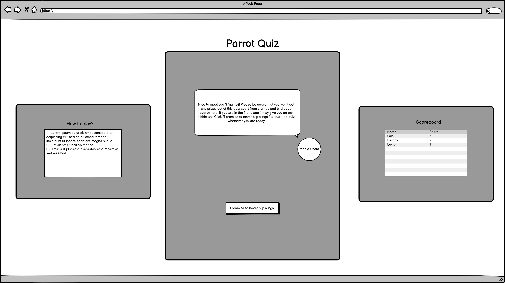
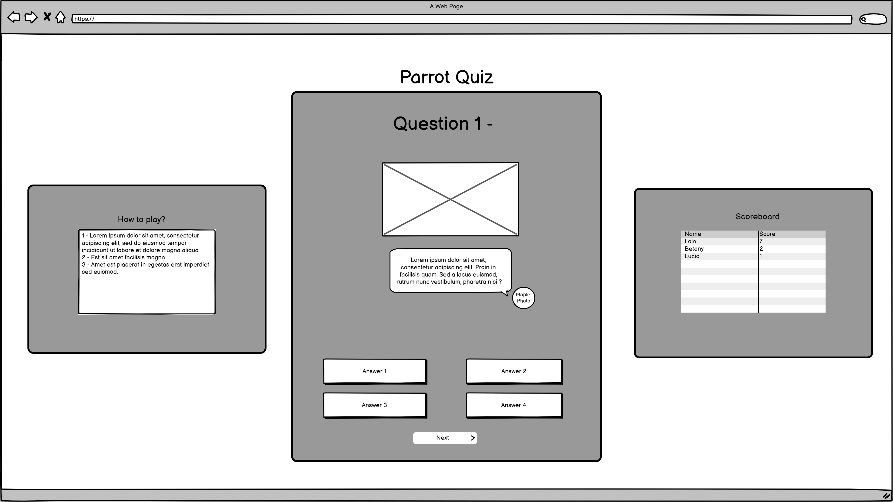
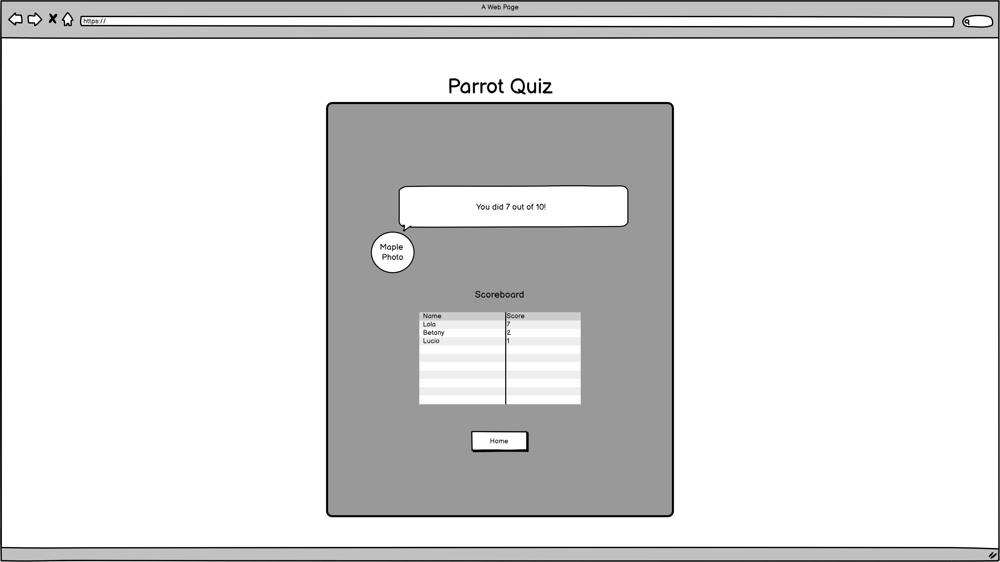
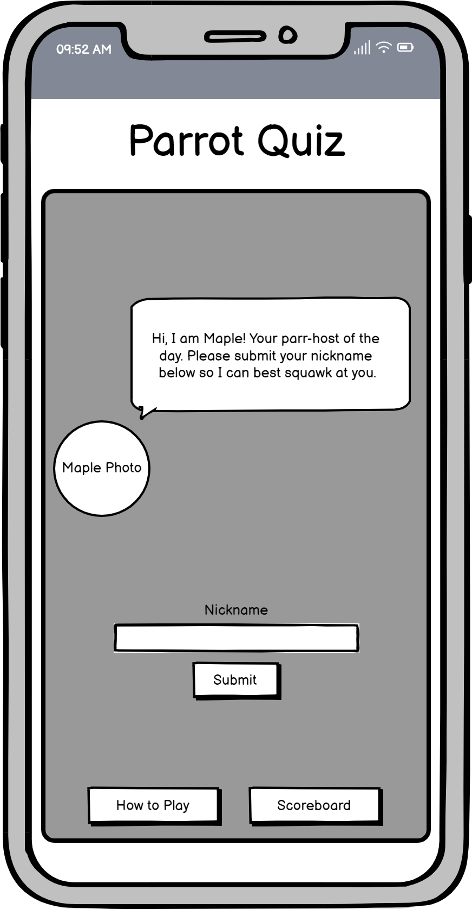
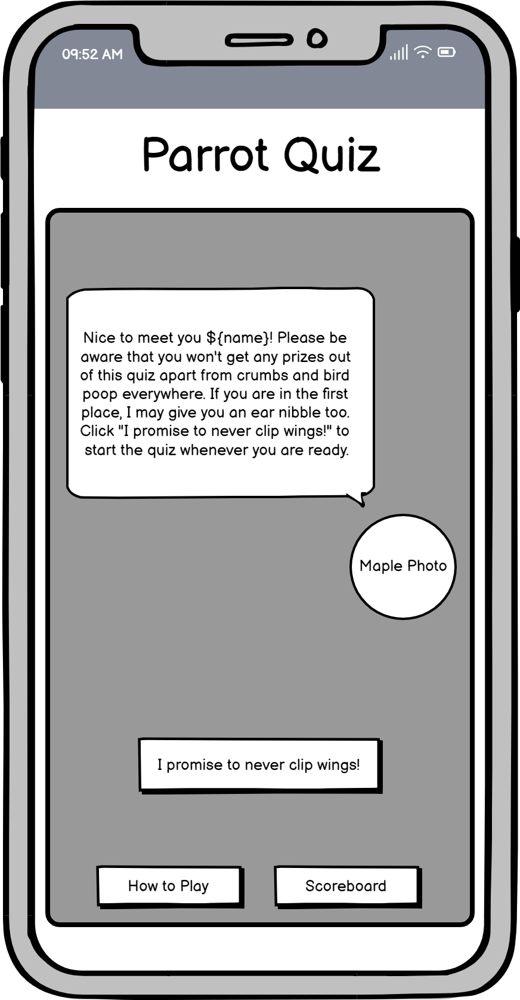
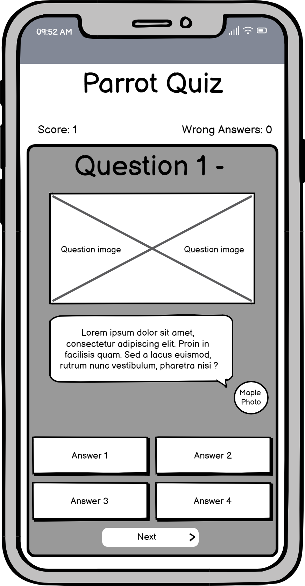
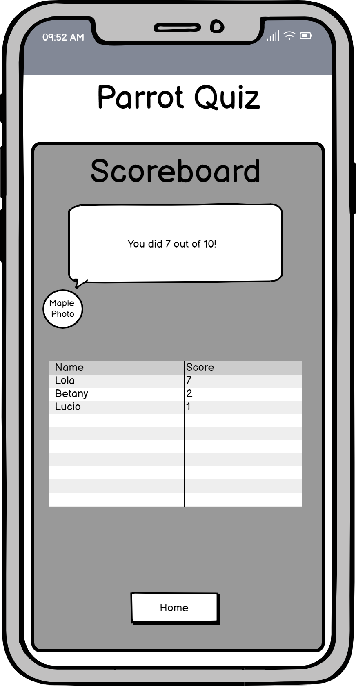
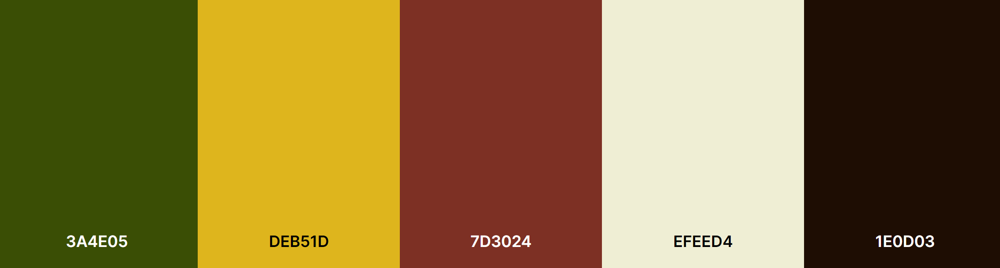

<h2><a href="https://luciotorelli.github.io/parrot-quiz/index.html" target="_blank">Live Website here</a></h2>

Parrot Quiz
---

Parrot Quiz is an interactive multiple question game to test your knowledge about our feathered friends, it is hosted by a parrot named Maple.

## Table of Contents

1.  [Overview](https://github.com/luciotorelli/parrot-quiz#logo)
2.  [User Stories](https://github.com/luciotorelli/parrot-quiz#user-stories)
3.  [Site Owner Goals](https://github.com/luciotorelli/parrot-quiz#site-owner-goals)
4.  [Wireframe](https://github.com/luciotorelli/parrot-quiz#wireframe)
5.  [Color Scheme and Typography](https://github.com/luciotorelli/parrot-quiz#color-scheme-and-typography)
6.  Features
    - Features
    - Future Features
7.  Technologies used
8.  Testing
    - 8.1 Code validation
    - 8.2 Test cases (User Feedback - Screenshots)
    - 8.3 Fixed Bugs
    - 8.4 Open Bugs
    - 8.5 Supported Screens and Browsers

9.  Deployment
    - 9.1 Gitpod
    - 9.2 Github pages
10. Credits
    - 10.1 Special Thanks!
    - 10.2 Resources used

---

## User Stories

- As a new user I would like to understand the theme of the quiz/game in the very first access.
- As a returning user I would like to easily access the scoreboard.
- As a user in the middle of a game I would like to check my score and wrong answers.
- As a user answering a question I would like to receive feedback in the form of text or color of my guess.

---

## Site Owner Goals:

- Create a website for testing the user's knowledge on parrots.
- The website is interactive, fun and easy to navigate.
- The website is responsive and adaptable for Mobile, Desktop and in-between screens.
- The website/game purpose is easily identifiable on the very first visit.

---

## Wireframe

   
Desktop

   
-  

         
Homepage

            
      

- 

     
Nickname submitted

        
  

- 

     
Question

        
  

- 

     
Scoreboard

        
  
  

   
Mobile

      
-  

         
Homepage

            
      

- 

     
Nickname submitted

        
  

- 

     
Question

        
  

- 

     
Scoreboard

        
  

  

---

## Color Scheme and Typography

1. ### Color Scheme

1. ### Typography

[Google Fonts - Nunito](https://fonts.google.com/specimen/Nunito)

---

## Features

---

## Technologies used

- [HTML 5](https://en.wikipedia.org/wiki/HTML5) - The HyperText Markup Language or HTML is the standard markup language for documents designed to be displayed in a web browser.
- [CSS3](https://www.w3schools.com/css/) - Cascading Style Sheets (CSS) is a style sheet language used for describing the presentation of a document written in a markup language such as HTML.
- [Github and Git](https://docs.github.com/en/get-started/using-git/about-git) - GitHub, Inc., is an Internet hosting service for software development and version control using Git.

---

## Testing

---

## Deployment

---

## Credits

### Special Thanks!

