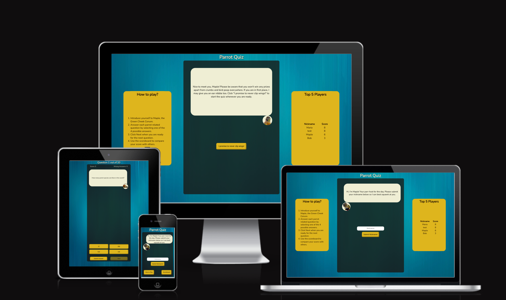

<h2><a href="https://luciotorelli.github.io/parrot-quiz/index.html" target="_blank">Live Website here</a></h2>

Parrot Quiz
---

Parrot Quiz is an interactive multiple question game to test your knowledge about our feathered friends, it is hosted by a parrot pet named Maple.

## Table of Contents

1.  [Overview](https://github.com/luciotorelli/parrot-quiz#overview)
2.  [User Stories](https://github.com/luciotorelli/parrot-quiz#user-stories)
3.  [Site Owner Goals](https://github.com/luciotorelli/parrot-quiz#site-owner-goals)
4.  [Wireframe](https://github.com/luciotorelli/parrot-quiz#wireframe)
5.  [Color Scheme and Typography](https://github.com/luciotorelli/parrot-quiz#color-scheme-and-typography)
6.  [Features](https://github.com/luciotorelli/parrot-quiz#features)
    - [Features](https://github.com/luciotorelli/parrot-quiz#features-1)
    - [Future Features](https://github.com/luciotorelli/parrot-quiz#future-features)
7.  [Technologies used](https://github.com/luciotorelli/parrot-quiz#technologies-used)
8.  [Testing](https://github.com/luciotorelli/parrot-quiz#testing)
    - [8.1 Code validation](https://github.com/luciotorelli/parrot-quiz#testing)
    - [8.2 Test cases (User Feedback - Screenshots)](https://github.com/luciotorelli/parrot-quiz#testing)
    - [8.3 Fixed Bugs](https://github.com/luciotorelli/parrot-quiz#testing)
    - [8.4 Open Bugs](https://github.com/luciotorelli/parrot-quiz#testing)
    - [8.5 Supported Screens and Browsers](https://github.com/luciotorelli/parrot-quiz#testing)
9.  [Deployment](https://github.com/luciotorelli/parrot-quiz#deployment)
10. [Credits](https://github.com/luciotorelli/parrot-quiz#credits)
    - [10.1 Special Thanks!](https://github.com/luciotorelli/parrot-quiz#special-thanks)
    - [10.2 Resources used](https://github.com/luciotorelli/parrot-quiz#resources-used)
    - [10.3 Tutorials and Documentation used](https://github.com/luciotorelli/parrot-quiz#tutorials-and-documentation-used-no-code-were-copied-and-pasted-only-inspired-and-adapted)
    - [10.4 Imported library](https://github.com/luciotorelli/parrot-quiz#imported-library)

---

## User Stories

- As a new user I would like to understand the theme of the quiz/game in the very first access.
- As a returning user I would like to easily access the scoreboard.
- As a user in the middle of a game I would like to check my score and wrong answers.
- As a user answering a question I would like to receive feedback in the form of text or color of my guess.

---

## Site Owner Goals:

- Create a website for testing the user's knowledge on parrots.
- The website is interactive, fun and easy to navigate.
- The website is responsive and adaptable for Mobile, Desktop and in-between screens.
- The website/game purpose is easily identifiable on the very first visit.

---

## Wireframe

   
Desktop

   
-  

         
Homepage

            
      

- 

     
Nickname submitted

        
  

- 

     
Question

        
  

- 

     
Scoreboard

        
  
  

   
Mobile

      
-  

         
Homepage

            
      

- 

     
Nickname submitted

        
  

- 

     
Question

        
  

- 

     
Scoreboard

        
  

  

---

## Color Scheme and Typography

1. ### Color Scheme

The colors were selected using an ink dropper on an image of the pet (Maple) that inspired the quiz. Green is used to display the correct answers, yellow as a neutral color for buttons, red to display incorrect answers, white for text on some dark backgrounds and black as text/background. 

2. ### Typography

[Google Fonts - Nunito](https://fonts.google.com/specimen/Nunito)

Nunito was the selected typeface for the project for being ideal on a quiz due to the readability on smaller to bigger screens, on bigger blocks of texts or single line text.

---

## Features

   
Features

      1.  Landing Page - The landing page  provides the clear purpose of the website, a field to input your nickname (maximum 10 characteres) and depending on the size screen a modal button for how to play and scoreboard or a window on each side of the main body with the same information.
      
      2.  The first modal tells the player how to play with an option to close it by clicking outside of the screen, pressing the Escape key or via the X button.
      
      3.  The second modal shows the scoreboard with Top 5 players with an option to close it by clicking outside of the screen, pressing the Escape key or via the X button.
      
      4.  There is a third modal that will only be called in case the user attempts to submit nickname with the input field blank.
      
      5.  The introduction page will utilize the nickname submitted to provide a personalized greeting to the user, display the same scoreboard and how to play modals as well as a button to initiate the game.
      
      6.  The header of the quiz will display the current question number, the scores and wrong answers as well as the question on a speech bubble. 
      
      7.  The quiz will have 4 options for the user to select, a disabled submit answer and next answer buttons that will be enabled in order of submission.  
      
      8. Once the user selects an option, the selected option will have a 'clicked' effect and the submit answer button will be enabled. At this point the user is able to change their mind and select other options without affecting their score. 
      
      9. Once the user submits their answer, the submit answer button will be disabled and the next button will be enabled. There will be multiple features to inform the user if their answer were correct or not. For the right answer the parrot image will be replaced with a 'hands up' image, the body background and the selected button will be green. The question text will be replaced with a feedback regarding the right question.
      
      10. If the user selects the wrong answer, the body and the clicked button will turn red while the correct answer will have a higher opacity with the background green and an 'unclicked' effect. The parrot image will be replaced for a 'face palm' image. The next button will be enabled. The question text will be replaced with a feedback regarding the wrong answer.   
      
      11. Upon clicking on the next button, all styling in regards to the wrong or right answers are reset and a new question with it's answer options are loaded. The parrot image becames the 'neutral' again.    
      
      12. The state of the game is saved to the local storage and will bring the user back to where they paused the quiz in case of a page refresh or forward/backward key press. It also makes harder for cheating on the game as the score is only stored once the answer is submitted.
      
      13. Once the user reaches the last question, the next button will bring them to the end of quiz page with a message based on their score, a scoreboard of the top 5 players and a button to reset the quiz. If the user scores 4 or more, there will be a confetti rain effect on the screen. There are a total of 3 answers based on scores;
          
         - 1-3 points: "Thanks for completing the quiz {NAME}, you scored {SCORE} out of 10 questions. You don't know a lot about parrots but I hope you learned something today!"
          
         - 4-9 points: "Thanks for completing the quiz {NAME}, you scored {SCORE} out of 10 questions. You know quite a lot about parrots. I am impressed!"
          
         - 10 points: "Thanks for completing the quiz {NAME}, you scored an impressive {SCORE} out of 10 questions! You know more about parrots than most people, well done!"
          
      Clicking Restart will bring the user back to the homepage and will clear every field on local storage apart from the scoreboard.
            

   
Future Features

   1. Animation on some parts of the quiz such as the parrot profile image would create a more interactive experience.
   2. Store the scoreboard on a Google Spreadsheet so the Top 5 players would be displayed for every user instead of on the same device. (Requires backend implementation).
   3. An image related to each question to be displayed on the quiz. (Difficult due to the quiz theme and image royalties). 

---

## Technologies used

- [HTML 5](https://en.wikipedia.org/wiki/HTML5) - The HyperText Markup Language or HTML is the standard markup language for documents designed to be displayed in a web browser.
- [CSS3](https://www.w3schools.com/css/) - Cascading Style Sheets (CSS) is a style sheet language used for describing the presentation of a document written in a markup language such as HTML.
- [JavaScript](https://www.w3schools.com/js/) - JavaScript, often abbreviated as (JS), is a programming language that is one of the core technologies of the World Wide Web
- [Github and Git](https://docs.github.com/en/get-started/using-git/about-git) - GitHub, Inc., is an Internet hosting service for software development and version control using Git.

---

## Testing

   
8.1 Code validation

   <ul>
      <li>The code for all HTML files was tested against <a href="https://validator.w3.org/">W3C Markup validation service.</a></li>
      <li>The code for the CSS file was tested against <a href="https://jigsaw.w3.org/css-validator/">W3C CSS validation service.</a></li>
      <li>The code for the JavaScript file was tested against <a href="https://jshint.com/">JShint</a></li>      
      <li>All files were tested during development using the <a href="https://github.com/streetsidesoftware/vscode-spell-checker">Spelling checker for Visual Studio Code extension.</a> </li>
      <li><a href="https://developer.chrome.com/docs/devtools/">ChromeDev tools</a> built in console, application and lighthouse report were used to test the performance, state of game and load speed of the website.</li>
            
   </ul>

   
8.2 Test cases

   - A first time user was able to quickly understand the purpose of the website/game and how to navigate it. 
   
   - An IOS user provided feedback in regards to the text on some buttons were displayed in blue, this was later fixed on <a href="https://github.com/luciotorelli/parrot-quiz/commit/c77433201c1e3cc9c3644be5b52c0b810273951c">commit c77433201c1e3cc9c3644be5b52c0b810273951c.</a> 
   
   - When the quiz is initiated the user was able to quickly understand how to select and submit their answer and select a next question.
   
   - All 15 users that tested the project were able to reach the last screen on different devices, browsers and screen sizes.
      

   
8.3 Fixed Bugs

   <ul>
         <li>Nov 12 - <a href="https://github.com/luciotorelli/parrot-quiz/commit/d2bedfa913851a868f585fd1ccd6c0e722124624">Fix preGameMessage() error when loading index.html.</a></li>
         <li>Nov 18 - <a href="https://github.com/luciotorelli/parrot-quiz/commit/f2c0db7db4efb28a52b7ca225fcb13a5dc29f8ae">Fix Nickname submit button.</a></li>
         <li>Nov 18 - <a href="https://github.com/luciotorelli/parrot-quiz/commit/1705e0202bb0a5261b831daac7a24e5a3d388a23">Fix input typo from previous commit.</a></li>         
         <li>Nov 18 - <a href="https://github.com/luciotorelli/parrot-quiz/commit/a357a3e504c261fba5fed1bffc5bbf0642c0f2d9">Fix text within nickname button</a></li>         
         <li>Nov 19 - <a href="https://github.com/luciotorelli/parrot-quiz/commit/f7c3da05174cc71cf8d9c0d46655a0c3fc0275b5">Fix confirm answer function</a></li>         
         <li>Nov 19 - <a href="https://github.com/luciotorelli/parrot-quiz/commit/c548b8ee8c93ff018e60069200368f8027e65b7c">Fix score system after implementing confirm answer button.</a></li>         
         <li>Nov 19 - <a href="https://github.com/luciotorelli/parrot-quiz/commit/5b7f7408fad954ce704fe89a7a4708f3d8ed0d75">Fix error that allowed user to select another answer after confirming it.</a></li>         
         <li>Nov 20 - <a href="https://github.com/luciotorelli/parrot-quiz/commit/7a3d243863b1a808bef78df1e494683f902cbcf7">Fix currentQuestionIndex becoming string and window.location on live version.</a></li>         
         <li>Nov 20 - <a href="https://github.com/luciotorelli/parrot-quiz/commit/bf6cf8a7645b97cc604f60bf37bd52afb9632ab6">Fix for Github pages game.js URL redirection.</a></li>
         <li>Nov 21 - <a href="https://github.com/luciotorelli/parrot-quiz/commit/e99f976a429860ae453e3481230cdeefb97d7a63">Fix score count and question count elements in case user refreshes page.</a></li>                   
         <li>Nov 21 - <a href="https://github.com/luciotorelli/parrot-quiz/commit/a3e7942e74324887db3e5ea5189fac243a7fedc7">Fix bug that allowed users to resize screen, close modal and resize back to desktop</a></li>                   
         <li>Nov 21 - <a href="https://github.com/luciotorelli/parrot-quiz/commit/307170f5883edd374e90c08496c5b017b832e80c">Fix grammar and improve code comments.</a></li>                   
         <li>Nov 25 - <a href="https://github.com/luciotorelli/parrot-quiz/commit/a6dbc0472b2de80c4c759111bfc2797c445dbb47">Fix nickname close button on 1028px screens and up and fix resize of modals on screens 718px and up.</a></li>    
         <li>Nov 26 - <a href="https://github.com/luciotorelli/parrot-quiz/commit/425322c50002194690529a1dc870f989795836fe">Fix color of nickname error close button</a></li>           
         <li>Nov 26 - <a href="https://github.com/luciotorelli/parrot-quiz/commit/68ace84dbc7db87f1005fd2eb36886276865ef3f">Fix final score being pushed to table on refresh.</a></li>
         <li>Nov 26 - <a href="https://github.com/luciotorelli/parrot-quiz/commit/c77433201c1e3cc9c3644be5b52c0b810273951c">Fix blue button text on IOS devices.</a></li>
         <li>Nov 26 - <a href="https://github.com/luciotorelli/parrot-quiz/commit/201a9e1b576c3e0e50ef59d46a7f891634fdfea6">Fix blue button text on IOS devices.</a></li> 
         <li>Nov 26 - <a href="https://github.com/luciotorelli/parrot-quiz/commit/37b5957107fcfa3f4aff46e2ac5d114ae1e9d48c">Fix Home/Restart button click animation</a></li>                                           
   </ul>

   
8.4 Unfixed Bugs

   * Depending on the device rescaling settings, the answer buttons may push the submit answer and next buttons outside the quiz section.
   * Some devices displayed OS issues that were not present on the ChromeDev emulator, fixes were issued for devices that were available during development.

   
8.5 Supported Screens and Browser

  
  - Screen sizes:
    - 320px — 480px: Mobile devices
    - 481px — 768px: Tablets
    - 769px — 1024px: Tablets and Laptops
    - 1025px — 1200px: Desktop and Large screens
    - 1201px and up: Large Screens
  - Browsers:
    - Chrome.
    - Firefox.
    - Opera.
    - Microsoft Edge.

---

## Deployment

The project was deployed using [Github pages](https://pages.github.com/) and updated using the [Live Server VScode extension](https://marketplace.visualstudio.com/items?itemName=ritwickdey.LiveServer) following those steps; 

1. Development of project and testing using VScode and Live Server on Chrome, Firefox, Opera and Edge.
2. Once development was completed the page was deployed by heading first to Settings on Github.
3. Clicking on Pages on the left sidebar.
4. Selecting the main branch.
5. Clicking save.

---

## Credits

### Special Thanks!

- Rohit Code Institutor Mentor - I am very grateful for the guidance provided by Rohit and for pointing all the improvement opportunities of my project.
- [@tvianna](https://github.com/tvianna) - My sister that provided feedback on the project and for sharing all extensions she uses on VScode.
- [@Neil Deignan](https://www.linkedin.com/in/neil-deignan-6b7270b2/) - My partner for testing the quiz multiple time on his devices and provide feedback during development.
- My colleague group (Eggs) - Thanks to my colleagues for testing my project on multiple devices and providing feedback during development.
- My family and friends that were kind enough to test the quiz on their devices and provide me 
 with feedback and screenshots.
- My study group for sharing the struggles/challenges and keeping each other progressing! ([@alexiiasantos](https://github.com/alexiiasantos), Bohdan, [@GaryS007](https://github.com/GaryS007), [@oconnorian3](https://github.com/oconnorian3), [@James-Fitz](https://github.com/James-Fitz), [@zemaciel](https://github.com/zemaciel), Thomas and Yanina)
- [@WebDevSimplified](https://github.com/WebDevSimplified) for [this awesome tutorial on Flexbox](https://www.youtube.com/watch?v=fYq5PXgSsbE) that I came back to multiple times during the project.

### Resources used

  - [Code Institute Full Stack - Course material, mentoring and tutoring](https://codeinstitute.net/ie/full-stack-software-development-diploma/)
  - [Stackoverflow - Having the answers to many of my questions](https://stackoverflow.com/)
  - [W3Schools - Used to check how to use certain CSS properties and HTML elements](https://www.w3schools.com/)
  - [Balsamiq - Used to draw the wireframes of the project](https://balsamiq.com/)
  - [W3C markup validation service](https://validator.w3.org/)
  - [Jigsaw CSS validation service](https://jigsaw.w3.org/css-validator/)
  - [JShint](https://jshint.com/)
  - [Pexels - Used to get all images and videos used in the project](https://www.pexels.com/)
  - [Chrome Devtools - Used to debug the code, test responsiveness and run lighthouse reports](https://developer.chrome.com/docs/devtools/)
  - [Coolors - Used to create the color palette for the project](https://coolors.co/)
  - [Contrast Ratio - Used to test the color ratio of the project](https://contrast-ratio.com/)
  - [WebAim Constrat Checker - Equally used to test the color ratio of the project](https://webaim.org/resources/contrastchecker/)
  - [Pixlr - Used to resize and edit contrast of images used on the project](https://pixlr.com/e/)
  - [Optimizilla - Used to optimize the images used in the project](https://imagecompressor.com/)
  - [Can I Use - Used to test properties cross browser compatibility](https://caniuse.com/)
  - [Autoprefixer - Used to add properties for cross browser compatibility](https://autoprefixer.github.io/)
  - [VScode - Used to write the code for this project](https://code.visualstudio.com/)
  - [Gitpod - Used in the initial part of the project until a local desktop environment was setup.](https://gitpod.io/workspaces)
  - [YouTube Music - Used to listen to hours of lofi song during the project development](https://music.youtube.com/)
  - [Am I responsive? - Used to create main image used on README](https://ui.dev/amiresponsive)
  - [Google Fonts - Used to import Google font to the project](https://fonts.google.com/specimen/Open+Sans?query=open)
  - [Screen Reader Chrome Extension - Used to test aria-label and accessability](https://chrome.google.com/webstore/detail/screen-reader/kgejglhpjiefppelpmljglcjbhoiplfn?hl=en)

### Tutorials and Documentation used (No code were copied and pasted, only inspired and adapted)

   - [W3C - Create a responsive popup modal with CSS & JavaScript](https://w3collective.com/popup-modal-javascript/)
   - [WebDev simplified - Build A Quiz App With JavaScript](https://www.youtube.com/watch?v=riDzcEQbX6k&ab_channel=WebDevSimplified)
   - [Developer Mozilla - Window: load event](https://developer.mozilla.org/en-US/docs/Web/API/Window/load_event)
   - [Clubmate Fi - Remove a class name from multiple elements with pure JavaScript](https://clubmate.fi/remove-a-class-name-from-multiple-elements-with-pure-javascript)
   - [Folks talk - Accessing Objects Inside Array With Code Examples](https://www.folkstalk.com/tech/accessing-objects-inside-array-with-code-examples/)

### Imported library
 - The confetti animation is an imported library. Author: mathusummut. Found [on CSS script.](https://www.cssscript.com/confetti-falling-animation/)